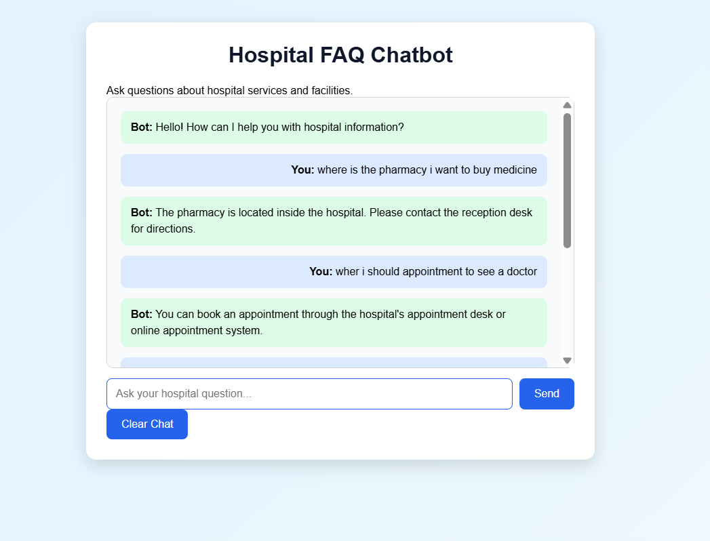

# Hospital FAQ Chatbot

## Project Description

This project is an NLP-based Hospital FAQ Chatbot developed as part of the CodeAlpha Internship.

The chatbot allows users to ask common hospital-related questions and provides the most relevant answer using predefined FAQs.

The system uses intent-based matching and text similarity to identify the user's question.

## Features

- Hospital-related FAQ chatbot
- Appointment information
- Doctor availability information
- Hospital location information
- Pharmacy and laboratory information
- Visiting hours
- Patient registration information
- Medical report information
- Payment information
- Parking information
- Emergency information
- Unknown question handling
- Clear chat option
- Enter key support
- Responsive user interface

## Technologies Used

- HTML
- CSS
- JavaScript
- Python
- Flask
- NLTK
- Scikit-learn
- TF-IDF
- Cosine Similarity

## How It Works

```text
User Question
      ↓
Text Processing
      ↓
Intent Detection
      ↓
TF-IDF and Cosine Similarity
      ↓
Find Relevant FAQ
      ↓
Return Answer
      ↓
Display Response
Screenshot

